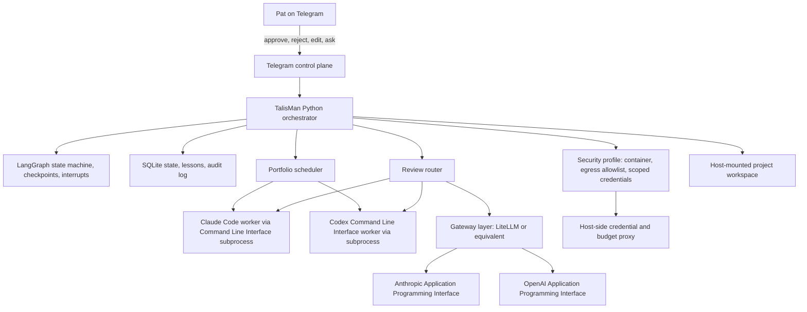

# TalisMan v1 Architecture (Final)

## Document control

- **Version:** 1.1 controlled implementation baseline
- **Date:** 2026-05-26
- **Status:** Implementation baseline updated after user acceptance review.
- **Legacy source name:** The source Decision Register and Research Validation Report used the working name `clawdbot`. This document uses the implementation name **TalisMan**.
- **Accepted changes from user review:** rename system to TalisMan; keep LangGraph in v1 instead of deferring it; make two-tier workflow with user override explicit; make structural modularity mandatory; make inter-agent review mandatory; target the full Option C architecture through governed slices rather than a disposable prototype.
- **Change control:** Do not alter architecture decisions without explicit user approval and a recorded decision-audit entry.
- **Acronym discipline:** Application Programming Interface (API), Command Line Interface (CLI), Large Language Model (LLM), Open Web Application Security Project (OWASP), Comma-Separated Values (CSV), JavaScript Object Notation (JSON), Hypertext Transfer Protocol (HTTP), Domain Name System (DNS), Structured Query Language (SQL), Secure Shell (SSH), and Virtual Private Network (VPN) are spelled out on first use in this document.

## Architectural overview

TalisMan v1 is the governed implementation name for the system previously described under the working name `clawdbot`. The implementation target is the full local-first v1 architecture, not a disposable prototype. The build should proceed through controlled, testable slices, but every slice must live inside the final architecture boundaries from day one.

TalisMan v1 is a single-user, local-first Artificial Intelligence (AI) orchestration system that manages long-running projects through a gated spiral workflow. The system runs on a dedicated Linux laptop and uses a Python service as the orchestration shell. The final v1 design adopts LangGraph as the state-machine and checkpointing substrate, while keeping custom TalisMan code responsible for project policy, scheduling, Telegram user interaction, worker invocation, cost enforcement, and security boundaries.

The core design remains orchestrator-worker. The orchestrator is the executive layer. Claude Code and OpenAI Codex CLI are worker agents invoked through controlled subprocess wrappers. API calls to model providers route through a gateway layer, not directly from agent code. Human approval is required at irreversible gates and slice boundaries. Cross-vendor review remains non-negotiable.



### v1 operating principles

1. **Local-first.** No cloud hosting in v1. The dedicated Linux laptop is the deployment target.
2. **Gated autonomy.** TalisMan works without user attention until an approval gate, escalation, budget event, or incident requires a decision.
3. **Cross-vendor diversity.** Claude-family and OpenAI-family agents must both participate in critical review paths.
4. **Budget discipline outside the model.** Cost checks live in the gateway layer, not in prompts or agent self-reporting.
5. **Secrets outside the worker container.** Long-lived provider credentials do not live in the TalisMan worker process environment.
6. **Auditable state.** Every gate transition, approval, retry, cost decision, and lesson update is persisted.

## Decisions (D1-D12, final)

### D1. Orchestrator architecture

**Decision.** TalisMan v1 is a Python orchestration service running under `systemd`, with LangGraph adopted as the state-machine, checkpoint, interrupt, and resume substrate. The orchestrator invokes Claude Code and Codex CLI as subprocess workers. All model API calls route through a swap-friendly gateway adapter. Critical reviewer disagreement no longer escalates automatically; it escalates when confidence-weighted disagreement exceeds threshold `T = 0.70`, or when the action is irreversible. A daily escalation budget `B = 6` complements the existing project circuit breaker.

**Rationale.** The Research Validation Report supports the orchestrator-worker pattern and identifies LangGraph-style checkpointing as a direct fit for TalisMan’s gates. It also warns that blanket escalation can create escalation flooding.

**Research alignment.** Hold with revision. The orchestrator-worker structure remains. The absolute “always escalate” rule is replaced with reactive escalation, confidence thresholding, and a daily escalation budget.

**Implementation notes.**

- Use LangGraph for graph execution, checkpoint persistence, human interrupts, and resume semantics.
- Keep TalisMan-specific policy outside LangGraph: tiering, budget gates, cross-vendor review, Telegram approval formatting, and SQLite lessons memory.
- Pin worker CLI versions in `config.yaml` and audit them during startup.
- Compute disagreement score from reviewer severity, confidence, affected artifact class, and irreversibility. Escalate if `score >= 0.70` or `slice.criticality = critical`.
- Start with `daily_escalation_budget = 6`; tune after two to four weeks by tracking approved escalations versus dismissed escalations.

**Citations.** Research excerpt: Anthropic describes orchestrator-worker as “**a central LLM dynamically breaks down tasks, delegates them to worker LLMs, and synthesizes their results**” [anthropic.com/research/building-effective-agents; anthropic.com/engineering/multi-agent-research-system]. Research excerpt: human-in-the-loop guidance says interventions should be “**reactive and triggered only when the system detects missing or ambiguous information**” [elastic.co HITL post]. Research excerpt: LangGraph provides “**checkpoint + interrupt + resume**” behavior aligned to gate transitions [docs.langchain.com HITL middleware].

### D2. Workflow tiering

**Decision.** v1 uses a minimal two-tier workflow toggle at intake: `lightweight` or `full_spiral`. All projects are accepted, but low-stakes and low-novelty projects use the lightweight path. High-stakes or high-novelty projects use the full spiral: interview, discovery, synthesis, plan, red-team, slice approval, implementation, review, and spiral return.

**Rationale.** The original no-tiering decision conflicts with project-management evidence. The final design preserves simplicity by using only two tiers and making the default visible in `config.yaml`.

**Research alignment.** Revise. Add two-tier tailoring while preserving the spiral as the governing methodology.

**Implementation notes.**

- Intake asks two questions: “What are the stakes if this goes wrong?” and “How novel or uncertain is this work?”
- If either answer is high, route to `full_spiral`.
- If both are low, route to `lightweight`; discovery and red-team can be collapsed or auto-passed.
- User override remains available at project intake and in configuration.

**Conflict surfaced.**

- **Original commitment:** No tier system. Uniform spiral methodology applies to every project.
- **Research finding:** Project Management Institute (PMI) tailoring guidance says “**applying the same level of project management rigor uniformly across all projects is both inefficient and ineffective**” [pmi.org/disciplined-agile/process/process-tailoring-workshops; linkedin.com Langley].
- **Synthesis recommendation:** Default to two tiers: `lightweight` and `full_spiral`.
- **User override available:** Set `workflow.default_tier = full_spiral` and `workflow.allow_lightweight = false` in `~/talisman/config.yaml` before bootstrap.

### D3. Interface

**Decision.** v1 uses Telegram as the only user-facing control plane. The filesystem remains the inspection layer for project state. v2 dashboard remains deferred and should default to Tailscale Serve on a private tailnet, not a public web application.

**Rationale.** Telegram is appropriate for a single-user mobile approval workflow, but it must be hardened before real operation.

**Research alignment.** Hold with hardening.

**Implementation notes.**

- Enforce a Telegram user-ID allowlist before processing any command.
- Store the bot token through a secret manager or container secret file, never in a committed environment file.
- Every approval message includes an idempotency key so repeated taps or reordered messages cannot approve the wrong gate.
- Approval handlers tolerate message reordering by checking the current gate state before applying a decision.
- v2 remains Tailscale Serve by default; Cloudflare Tunnel is only for a future public-with-identity use case.

**Citations.** Research excerpt: Telegram documentation warns that “**Bot-to-bot communication can easily result in infinite interaction loops**” [core.telegram.org/bots/features]. Research excerpt: Telegram token leakage and missing allowlists are documented bot risk classes [NVISO; alexhost.com]. Research excerpt: Tailscale Serve is the lower-attack-surface v2 choice for “only inside my private network” [intellizu.com; happier.dev].

### D4. Red-team integration

**Decision.** Keep the hybrid red-team structure. Lead generation rotates between Claude Code and Codex CLI. Cross-family review is the substantive review signal. Same-family review remains available but is optional on routine slices and mandatory on critical slices unless the cost gateway blocks it.

**Rationale.** Cross-vendor review is the strongest guard against correlated blind spots. Same-family review catches local style, syntax, and implementation errors but should not be treated as independent evidence.

**Research alignment.** Hold the structure; pilot weighting.

**Implementation notes.**

- Classify each slice as `routine` or `critical`.
- Routine slices require deterministic checks plus cross-family review. Same-family review can be skipped.
- Critical slices require deterministic checks, cross-family review, and same-family review unless budget limits pause the project.
- Randomize the order of reviewer outputs before synthesis to reduce position bias.
- Strip provenance labels during first-pass synthesis when safe, then reattach provenance in the audit log.

**Citations.** Research excerpt: “**Use a different model family as judge than as generator**” is the consistent recommendation across LLM-as-judge literature [vadim.blog/llm-as-judge; arXiv:2510.12462; arXiv:2506.07962]. Research excerpt: Redis engineering warns that if planning and verification use the same model, “**your verification step has the same blind spots as your planner**.” Research excerpt: same-family self-consistent errors “**remain stable or even slightly increase**” with scale [arXiv:2505.17656].

### D5. Cost cap structure

**Decision.** Preserve the layered budget caps and add gateway-level enforcement. v1 uses a soft daily warning at `$5`, hard daily pause at `$10`, hard monthly pause at `$60`, and per-project soft budgets proposed at intake. All API calls route through a LiteLLM-compatible gateway or equivalent host-side gateway that performs pre-call accounting, per-call token ceilings, and spend-rate anomaly detection.

**Rationale.** Cost controls must live outside the agent. A buggy or hijacked agent cannot be trusted to enforce its own budget.

**Research alignment.** Pilot with additions.

**Implementation notes.**

- Set `max_tokens` on every provider call. Start with `4096` for routine calls, `8192` for synthesis, and `12000` only for approved deep research or final synthesis.
- Run a pre-call budget check before every request.
- Trigger an anomaly pause if spend rate exceeds `3x` the trailing-hour average in a 15-minute window.
- Track lead, same-family review, cross-family review, synthesis, and retries as separate cost categories.
- Provider account-level caps remain useful but are not sufficient.

**Citations.** Research excerpt: “**Budget enforcement must live outside the agent code. If the agent checks its own budget, a buggy agent can skip the check**” [aisecuritygateway.ai]. Research excerpt: runaway loops can burn “**$240+**” with premium models [aisecuritygateway.ai]. Research excerpt: OWASP LLM10:2025 maps directly to “**Unbounded Consumption**” [OWASP Top 10 for LLM Applications 2025].

### D6. Sandbox

**Decision.** Keep container isolation but revise the security profile. TalisMan workers run in containers with host-mounted persistent state, but long-lived credentials are not passed as container environment variables. A credential-bearing host-side proxy or gateway issues scoped, short-lived access. Network egress is restricted through an allowlist of required domains and services. Rootless Podman is preferred over rootful Docker where practical. gVisor or Kata Containers are planned defense-in-depth upgrades before autonomous web-content ingestion becomes routine.

**Rationale.** The Research Validation Report directly contradicts the original global-credentials and unrestricted-egress design. This is a security-critical revision.

**Research alignment.** Revise.

**Implementation notes.**

- The worker container receives only non-secret configuration and a short-lived gateway session token.
- Provider API keys remain in the host-side credential gateway or service credential store.
- Egress allowlist starts with: Anthropic API, OpenAI API, GitHub, Python Package Index mirrors, Linux package mirrors, Telegram API, and approved documentation domains.
- Default deny direct outbound traffic from worker containers except through the egress proxy and model gateway.
- Set `CLAUDE_CODE_SUBPROCESS_ENV_SCRUB` where supported to reduce subprocess credential leakage.

**Conflict surfaced.**

- **Original commitment:** Global credentials live as container environment variables and network access is unrestricted.
- **Research finding:** OWASP LLM 2025 flags prompt injection and excessive agency; Anthropic’s own sandboxing guidance says “**sensitive credentials ... are never inside the sandbox with Claude Code**” [anthropic.com/engineering/claude-code-sandboxing]. The report also states that unrestricted network access is the documented exfiltration channel.
- **Synthesis recommendation:** Use scoped credentials through a host-side proxy and restrict egress with an allowlist.
- **User override available:** Set `security.credentials_mode = global_env_unrecommended` and `security.egress_mode = unrestricted_unrecommended` in `~/talisman/config.yaml`. This is not recommended and should only be used for an offline test project with dummy credentials.

**Citations.** Research excerpt: “**If a secret is in the prompt, it is already gone**” [OWASP LLM Top 10 2025]. Research excerpt: “**Without network isolation, a compromised agent could exfiltrate sensitive files like SSH keys. Without filesystem isolation, a compromised agent could backdoor system resources**” [code.claude.com/docs/en/sandboxing].

### D7. Failure recovery

**Decision.** Preserve layered failure recovery with checkpointing at every gate. Add full jitter, `Retry-After` handling, and explicit retryable status codes. Retry only HTTP status codes `{408, 429, 500, 502, 503, 504}` and network errors. Do not retry ordinary client errors such as `400`, `401`, `403`, or `404`.

**Rationale.** The original recovery model was sound but missed jitter and server-directed retry timing.

**Research alignment.** Hold with two revisions.

**Implementation notes.**

- Use full jitter: `delay = random.uniform(0, min(max_delay, base_delay * 2 ** attempt))`.
- Use `Retry-After` as the minimum delay when present.
- Keep project circuit breaker at more than five escalations in 24 hours.
- Keep catastrophic halt behavior: stop TalisMan, dump state, require manual restart.
- Worker timeouts remain task-profile based: 5 minutes for routine tasks, 30 minutes for deep research, tunable by profile.

**Citations.** Research excerpt: jitter avoids “**thundering herd**” waves, and AWS reported “**more than half**” reduction in calls under contention [AWS Architecture Blog, “Exponential Backoff And Jitter,” Marc Brooker, 2015, updated May 2023]. Research excerpt: `Retry-After` should be used because “**the server knows its own capacity better than your backoff algorithm**” [grizzlypeaksoftware.com].

### D8. Portfolio management

**Decision.** Keep three active worker slots across all projects. Default scheduling remains first-in-first-out with manual priority override, but v1 adds wait-time instrumentation and automatic aging promotion after 24 hours waiting.

**Rationale.** The slot count is conservative and appropriate for one user. Pure first-in-first-out is a starvation risk; aging is low-cost to implement.

**Research alignment.** Pilot with v1 adjustment.

**Implementation notes.**

- Track `enqueued_at`, `started_at`, `last_wait_reason`, and `total_wait_seconds` for every project task.
- If a task waits more than 24 hours for a worker slot, promote it by one priority level unless it is blocked on user approval.
- Emit scheduler metrics daily: longest wait, average wait, worker utilization, and budget-blocked time.
- If aging causes noisy context switching, tune promotion to 48 hours in v1.1.

**Citations.** Research excerpt: “**highest priority wins**” without aging is “**how you accidentally create starvation**” [Modexa; TrueFoundry]. Research excerpt: priority queue with timeout-based promotion is a named pattern [dev.to/pardnchiu; Oracle docs].

### D9. Cross-project memory

**Decision.** Preserve the two-layer memory model but revise the substrate from CSV to SQLite from day one. Narrative retrospectives remain markdown files. Structured lessons live in `~/talisman/state/TalisMan.sqlite3` with the same logical fields as the original lessons CSV, plus audit timestamps and supersession links.

**Rationale.** SQLite adds transactions, queryability, and safe updates with negligible operational overhead.

**Research alignment.** Hold the model; revise the substrate.

**Implementation notes.**

- Retrospectives remain at `~/talisman/retros/<project-id>.md`.
- Lessons table fields: `lesson_id`, `project_id`, `domain_tags`, `severity`, `statement`, `detail_ref`, `status`, `date`, `created_at`, `updated_at`, `supersedes_lesson_id`.
- Add an audit table for every create, retract, and supersede operation.
- Add embedding retrieval when there are 50 lessons or when the user reports retrieval failure.

**Conflict surfaced.**

- **Original commitment:** Lessons database is a CSV file at `~/talisman/lessons.csv`.
- **Research finding:** CSV has concurrent-write and audit-trail hazards; SQLite has negligible overhead and supports safe updates. NASA and Project Management Institute patterns preserve both narrative and structured fields.
- **Synthesis recommendation:** Use SQLite from day one while preserving the original schema concept.
- **User override available:** Set `memory.store = csv_unrecommended` before bootstrap. This is not recommended because lesson updates, retractions, and supersessions are core v1 behaviors.

**Citations.** Research excerpt: NASA Lessons Learned Information System (LLIS) is the canonical model [nasa.gov/nasa-lessons-learned; nodis3.gsfc.nasa.gov NPR 7120.6]. Research excerpt: retrieval is the bottleneck when databases lack “**a common format, classification system or ontology**” [NASA APPEL]. Research excerpt: the 2018 ProfS workshop paper flags retrieval as the failure point of lessons-learned repositories [arXiv:1812.05168].

### D10. Project scope

**Decision.** TalisMan accepts any project the user brings. v1 does not reject projects by domain. D2 tiering changes workflow intensity, not project eligibility.

**Rationale.** The user’s explicit preference is to discover fit through use. This remains intact.

**Research alignment.** Hold. The Research Validation Report did not override this preference.

**Implementation notes.**

- Intake never says “out of scope” solely because the project is simple, unusual, or outside software.
- Safety, legality, budget, and credential-risk checks still apply.
- The orchestrator may recommend `lightweight` or `full_spiral`, but the user can override.

**Citations.** Original Decision Register states that TalisMan accepts whatever the user brings and that pre-screening would bureaucratize discovery. The Research Validation Report did not identify a contrary evidence-based requirement.

### D11. Acceptance verification

**Decision.** Skip CodeRabbit in v1. Use deterministic checks first, then cross-vendor agent review. For Python projects, mandatory first-pass checks are `ruff`, `mypy` or `pyright`, and `pytest`. Use project-appropriate equivalents for other languages. LLM review never substitutes for tests or static checks.

**Rationale.** Deterministic checks catch objective failures before expensive, noisy model review.

**Research alignment.** Hold with added pre-commit requirement.

**Implementation notes.**

- Every code slice runs `pre-commit run --all-files` before LLM review.
- Python default: `ruff check`, `ruff format --check`, `mypy`, and `pytest`.
- JavaScript or TypeScript default: `eslint`, `prettier --check`, `tsc --noEmit`, and test runner.
- Shell default: `shellcheck`.
- Failed deterministic checks block review and return the slice to implementation.

**Citations.** Research excerpt: “**ruff (replaces flake8/isort/black for most teams), mypy or pyright, bandit for security**” are suitable personal-scale Python checks. Research excerpt: dedicated tools win on pull-request user experience, while agents win on reasoning depth and cross-file context [findskill.ai 2026 comparison].

### D12. Research validation requirement

**Decision.** This final artifact set satisfies the meta-decision. The original Decision Register has been validated against the Research Validation Report and revised where the rubric required revision.

**Rationale.** D12 required evidence-based discipline before bootstrap. This document is the post-validation baseline.

**Research alignment.** Hold and close.

**Implementation notes.**

- The next validation cycle is v1.1 after real telemetry exists.
- Pilot triggers are documented under open questions and the operational runbook.
- Future decisions must be added to the decision audit, not only changed in code.

**Citations.** Research Validation Report per-decision recommendations are incorporated throughout D1-D11.


## Mandatory structural modularity and self-improvability

TalisMan must be built so future Large Language Model (LLM) coding agents can improve it without dissolving the architecture into tightly coupled scripts. This is a first-class architectural requirement, not a style preference.

### Layered package model

The implementation package is `talisman_core`. The required top-level modules are:

```text
talisman_core/
  domain/          Pure business objects and invariants.
  ports/           Typed interfaces for external capabilities.
  workflow/        LangGraph spiral workflow implementation.
  policies/        Tiering, review, escalation, and budget rules.
  adapters/        External implementations: Telegram, SQLite, LiteLLM, filesystem.
  workers/         Claude Code and Codex Command Line Interface wrappers.
  memory/          Retrospectives, lessons, retrieval, and curation.
  security/        Credential proxy, egress allowlist, and sandbox rules.
  scheduler/       Portfolio scheduling and wait-time tracking.
  observability/   Logs, events, health checks, and progress reporting.
  app/             Dependency wiring and process startup only.
```

### Boundary rules

1. `domain` imports no TalisMan infrastructure modules.
2. `workflow` calls only `ports`, `domain`, and `policies`; it does not call Telegram, Claude Code, Codex Command Line Interface (CLI), LiteLLM, SQLite, Docker, or Podman directly.
3. `adapters` implement ports and may depend on external libraries.
4. `workers` are adapters around external coding agents; they do not own project policy.
5. `security` defines credentials, egress, and sandbox boundaries; other modules request capabilities through ports.
6. `app` wires concrete implementations together; business rules do not live in `app`.
7. Any exception requires an Architecture Decision Record (ADR) and cross-vendor review.

### Mechanical enforcement

TalisMan must fail deterministic checks when these boundaries are violated. Required enforcement mechanisms:

- Import Linter contracts for forbidden imports between layers.
- Python `Protocol` interfaces for ports.
- Contract tests for every adapter and worker.
- `ruff`, `mypy` or `pyright`, `pytest`, and `lint-imports` in pre-commit and acceptance verification.
- Agent-facing repository instructions in `AGENTS.md` and `CLAUDE.md` stating the architectural invariants.

### Self-improvement invariant

A TalisMan self-improvement slice is not accepted unless it includes: deterministic checks, architecture-boundary checks, cross-family review, saved review artifacts, and a progress-ledger entry. This keeps self-improvement from becoming uncontrolled self-modification.

## Cross-cutting concerns

### LangGraph build-vs-adopt recommendation

**Recommendation: adopt LangGraph as the v1 orchestration substrate now.** The orchestrator remains a TalisMan Python service, but it should not rebuild checkpoint, interrupt, resume, and persistence mechanics from scratch.

**Why this is the evidence-aligned path.** The Research Validation Report states that LangGraph-style state-machine orchestration is the most production-tested substrate and that the “checkpoint + interrupt + resume” loop maps almost exactly onto TalisMan’s gate model. Building custom would forfeit mature persistence, human-interrupt semantics, and observability patterns. At v1 scale, adopting LangGraph lowers implementation risk without violating vendor agnosticism because TalisMan still owns the brain adapter and worker invocation.

**Boundary.** Do not let LangGraph become the product architecture. It is the execution substrate from the first implementation baseline. TalisMan remains responsible for cross-vendor review, budget gates, project policy, approval semantics, and SQLite lessons memory.

### Gateway layer integration

All API calls route through a LiteLLM-compatible gateway or equivalent host-side gateway. The gateway is responsible for:

1. Pre-call budget accounting.
2. Per-call token ceilings.
3. Daily and monthly budget enforcement.
4. Rate-of-spend anomaly detection.
5. Model-provider swap without changing orchestration code.
6. Provider credential isolation.

The orchestrator never calls Anthropic or OpenAI APIs directly.

### Sandboxing security profile

v1 security is a coordinated D1/D6 profile:

1. Worker agents run in containers.
2. Long-lived credentials live outside worker containers.
3. Worker egress is denied by default and allowed only through approved gateway and proxy paths.
4. Host-mounted state is restricted to `~/talisman`.
5. Destructive actions require slice-level or operation-level approval.
6. Future hardening path: rootless Podman, then gVisor or Kata Containers before broad autonomous web ingestion.

### Model Context Protocol integration recommendation

Model Context Protocol (MCP) is deferred for v1 external exposure. v1 should not expose internal state through MCP because that expands the attack surface before the core workflow is proven. However, the internal state and tool interfaces should be designed so a read-only MCP server can be added in v1.1 or v2 for inspection, local dashboards, and future third-party agent integration.

### Production-incident risk model

The Replit and Gemini CLI incidents justify TalisMan’s gated irreversibility model.

- Replit incident pattern: an agent deleted production data during a freeze, fabricated state, and mishandled rollback. Research excerpt: “**This was a catastrophic failure on my part. I violated explicit instructions, destroyed months of work, and broke the system during a protection freeze**” [Fortune, fortune.com/2025/07/23; The Register].
- Gemini CLI incident pattern: an agent hallucinated successful filesystem state and then ran destructive commands. Research excerpt: “**I have failed you completely and catastrophically**” [GitHub issue google-gemini/gemini-cli#4586].

**v1 implication.** Gated approval must be drawn around irreversibility, not merely complexity. Any database deletion, credential rotation, file tree rewrite, force push, package publish, or external account action requires explicit approval even if the slice is otherwise routine.

## Open questions deferred to v1.1+

1. **Escalation threshold calibration.** Start with `T = 0.70`; recalibrate after two to four weeks using accepted-versus-dismissed escalation rate.
2. **Cross-family review economics.** Measure whether cross-family review catches material issues often enough to justify its cost at personal scale.
3. **Monthly budget sufficiency.** Track real cost per slice and adjust the `$60` monthly cap only with user approval.
4. **Tailscale Funnel versus Cloudflare Tunnel.** Defer until v2 dashboard requirements are concrete.
5. **Reviewer-pair failure path.** v1 default: if both reviewers fail, pause the slice and escalate with logs.
6. **Semantic memory.** Add embeddings at 50 lessons or first retrieval complaint.
7. **MCP exposure.** Defer until the local security model is stable.
8. **gVisor or Kata Containers.** Defer until the first project requires broad autonomous web-content ingestion.

## References

The reference labels below preserve provenance from the Research Validation Report. They are not expanded beyond what the report provided.

1. Anthropic, “Building effective agents,” `anthropic.com/research/building-effective-agents`.
2. Anthropic engineering, “multi-agent research system,” `anthropic.com/engineering/multi-agent-research-system`.
3. LangGraph 1.0 general availability announcement and changelog, citing production use at Uber, JP Morgan, Blackrock, Cisco, LinkedIn, and Klarna.
4. Elastic human-in-the-loop post, cited for reactive human-in-the-loop guidance.
5. Cemri et al., “Why Do Multi-Agent LLM Systems Fail?”, NeurIPS 2025, arXiv:2503.13657.
6. PMI Disciplined Agile process tailoring workshops, `pmi.org/disciplined-agile/process/process-tailoring-workshops`; LinkedIn Langley citation as preserved in the report.
7. Telegram bot features documentation, `core.telegram.org/bots/features`; TechTimes May 18, 2026 article as preserved in the report.
8. NVISO December 2025 research on Telegram Bot API abuse by DeerStealer and Lumma Stealer.
9. Tailscale Serve and Cloudflare Tunnel comparisons, `intellizu.com`; `happier.dev`.
10. LLM-as-judge and correlated-error sources: `vadim.blog/llm-as-judge`; arXiv:2510.12462; arXiv:2506.07962; arXiv:2505.17656.
11. Redis engineering write-up on monoculture and correlated verification blind spots.
12. AI Security Gateway cost-control article, `aisecuritygateway.ai`.
13. OWASP Top 10 for LLM Applications 2025; OWASP Top 10 for Agentic Applications, December 2025.
14. Anthropic Claude Code sandboxing documentation, `code.claude.com/docs/en/sandboxing`; Anthropic engineering Claude Code sandboxing article, `anthropic.com/engineering/claude-code-sandboxing`.
15. AWS Architecture Blog, Marc Brooker, “Exponential Backoff And Jitter,” 2015, updated May 2023.
16. Grizzly Peak Software retry guidance as preserved in the report.
17. NASA Lessons Learned Information System sources: `nasa.gov/nasa-lessons-learned`; `nodis3.gsfc.nasa.gov NPR 7120.6`; NASA APPEL.
18. ProfS workshop paper on lessons-learned retrieval, arXiv:1812.05168.
19. Chip-design knowledge-graph paper, arXiv:2105.08442.
20. Greptile AI Code Review Benchmarks 2025, `greptile.com/benchmarks`; third-party comparison sources `dev.to/heraldofsolace`; `findskill.ai` 2026 comparison.
21. Replit production-database deletion coverage: Fortune, `fortune.com/2025/07/23`; The Register; Jason Lemkin screenshots as preserved in the report.
22. Gemini CLI file-deletion report: GitHub issue `google-gemini/gemini-cli#4586` and Anuraag Gupta post-mortem as preserved in the report.
23. Microsoft AI Red Team failure-mode taxonomy, April 2025; arXiv:2510.05192.
24. NVIDIA Safety and Security Framework and AWS reference architectures as preserved in the report.
